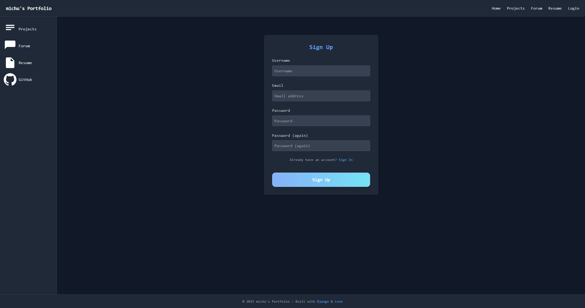

# 🧑‍💻 Portfolio App

A Django-based personal portfolio web application that allows users to showcase their skills, experience, and projects, interact with others via a built-in forum, and manage their online presence in a professional, modern way.

## ✨ Features

- **User Authentication:** Register, log in, log out securely.
- **Profile Management:**
  - Upload, update, or remove your profile picture.
  - Edit email, bio, and LinkedIn URL.
  - Fallback avatar with user initials if no photo is provided.
- **Project Showcase:** Create and display your own projects with live links.
- **Résumé Section:** Upload and manage your professional résumé and experience.
- **Interactive Forum:**
  - Create posts (e.g., AMA: Ask Me Anything)
  - Comment on posts
  - React with 👍 Like / 👎 Dislike to posts and comments
- **Responsive Design:** Tailwind CSS ensures a modern look on all devices.

## 🖼️ Screenshots

| Log In | Home Page |
|--------|-----------|
|  |  |

| Profile View | Profile Edit |
|--------------|--------------|
|  |  |

| Project Detail | Add Post (Forum) |
|----------------|------------------|
|  |  |

| Forum Comments |
|----------------|
|  |

## 🎬 Demo GIF

### Resume and Interactions


## 🧪 Tech Stack

- **Backend:** Django 5.2.1
- **Frontend:** Tailwind CSS, HTML, JavaScript
- **Database:** PostgreSQL
- **Libraries:** 
  - `django-crispy-forms`
  - `django-tailwind` 
  - `django-allauth`

## 🚀 Getting Started

1. **Clone the repository**  
   ```bash
   git clone https://github.com/michu999/Portfolio_app.git
   cd Portfolio_app
2. **Install dependencies**
    ```bash
    pip install -r requirements.txt
    npm install
3. **Apply migrations & run the server**
    ```bash
    python manage.py migrate
    python manage.py runserver
4. **Visit the app Open http://localhost:8000 in your browser.**

## ⚙️ Customization

    Update your profile picture and bio from the profile page.

    Add/edit projects via the dashboard.

    Join discussions and share knowledge via the forum.

## 📝 License

This project is built for educational and portfolio purposes.
Feel free to use it as inspiration for your own projects.